# AutoML System Architecture Diagrams

## 1. AutoML System Overview


## 2. Search Space Architecture


## 3. Metaheuristic Optimization Flow


## 4. Preprocessing Pipeline


## 5. Model Selection & Training


## 6. Fitness Evaluation Process

```mermaid
graph TB
    Model[Trained Model] --> TaskCheck{Task Type?}
    
    TaskCheck -->|Classification| ClassMetrics[Classification Metrics]
    TaskCheck -->|Regression| RegMetrics[Regression Metrics]
    
    ClassMetrics --> Acc[Accuracy]
    ClassMetrics --> F1[F1-Score]
    ClassMetrics --> ROC[ROC-AUC]
    
    RegMetrics --> RMSE[RMSE]
    RegMetrics --> MAE[MAE]
    RegMetrics --> R2[R² Score]
    
    Acc --> Combine[Combine Metrics]
    F1 --> Combine
    ROC --> Combine
    RMSE --> Combine
    MAE --> Combine
    R2 --> Combine
    
    Combine --> Fitness[Fitness Score]
    
    Fitness --> ConstCheck{Check<br/>Constraints}
    
    ConstCheck --> Time{Time Limit<br/>OK?}
    ConstCheck --> Complex{Complexity<br/>OK?}
    ConstCheck --> Memory{Memory<br/>OK?}
    
    Time -->|No| Penalize[Apply Penalty]
    Complex -->|No| Penalize
    Memory -->|No| Penalize
    
    Time -->|Yes| Final[Final Fitness]
    Complex -->|Yes| Final
    Memory -->|Yes| Final
    
    Penalize --> Final
    
    style Fitness fill:#99ff99
    style Final fill:#ffcc99
```



## 7. Complete AutoML Workflow


## 8. Constraint Handling System


## 9. Hyperparameter Space per Model

```mermaid
graph TB
    subgraph Logistic Regression
        LR[Logistic Regression] --> LR1[C: 0.001-100]
        LR --> LR2[penalty: l1, l2, elasticnet]
        LR --> LR3[solver: liblinear, saga]
    end
    
    subgraph SVM
        SVM[Support Vector Machine] --> SVM1[C: 0.1-100]
        SVM --> SVM2[kernel: linear, rbf, poly]
        SVM --> SVM3[gamma: scale, auto, 0.001-1]
    end
    
    subgraph Random Forest
        RF[Random Forest] --> RF1[n_estimators: 10-500]
        RF --> RF2[max_depth: 3-50]
        RF --> RF3[min_samples_split: 2-20]
        RF --> RF4[min_samples_leaf: 1-10]
    end
    
    subgraph XGBoost
        XGB[XGBoost] --> XGB1[learning_rate: 0.01-0.3]
        XGB --> XGB2[n_estimators: 50-500]
        XGB --> XGB3[max_depth: 3-15]
        XGB --> XGB4[subsample: 0.5-1.0]
    end
    
    subgraph Neural Network
        NN[Neural Network] --> NN1[hidden_layers: 1-5]
        NN --> NN2[neurons: 16-512]
        NN --> NN3[activation: relu, tanh, sigmoid]
        NN --> NN4[learning_rate: 0.0001-0.1]
        NN --> NN5[dropout: 0.0-0.5]
    end
    
    style LR fill:#ff9999
    style SVM fill:#99ccff
    style RF fill:#99ff99
    style XGB fill:#ffcc99
    style NN fill:#ff99cc
```

## 10. Performance Evaluation Flow


---

## Legend

- 🔵 **Blue**: Initialization/Input stages
- 🟢 **Green**: Evaluation/Validation stages
- 🟡 **Orange**: Output/Result stages
- 🔴 **Red**: Core AutoML components
- 🟣 **Purple**: Data processing stages
